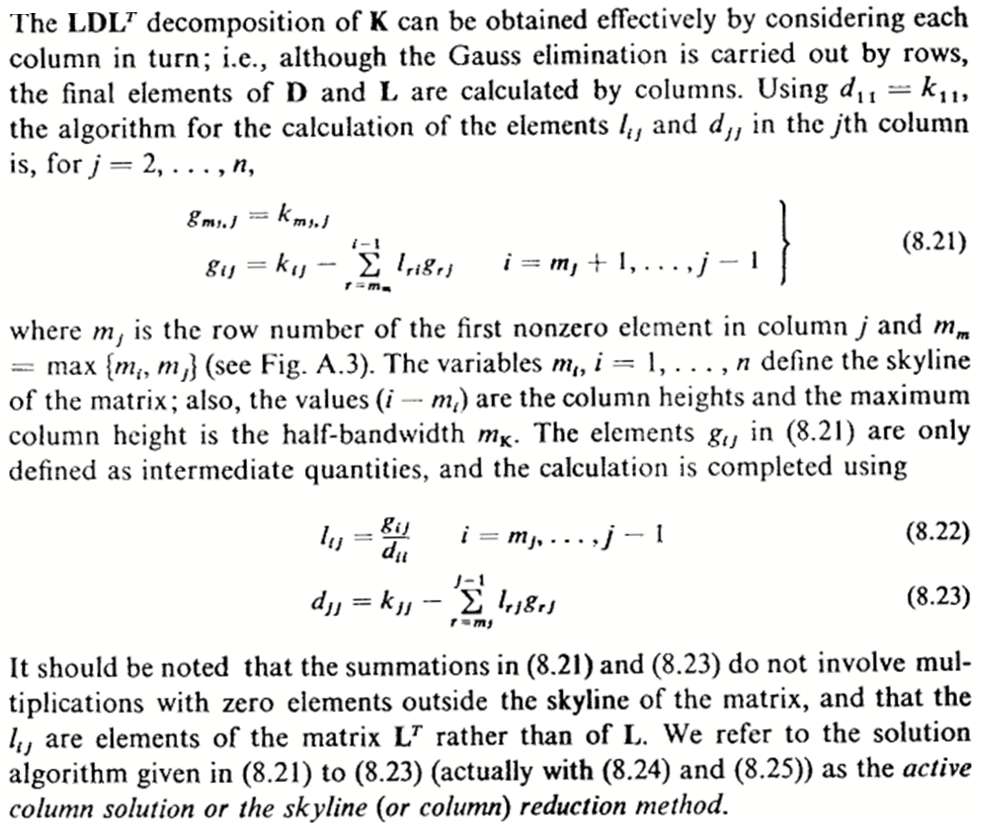
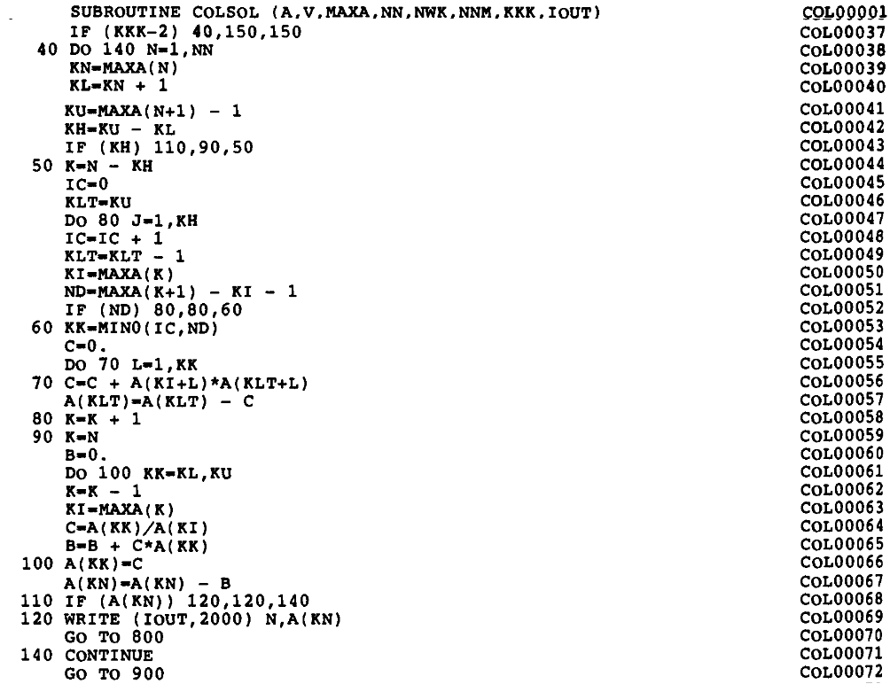

# Replacing legacy code with Julia

## Introduction

At some point, students of the finite element method need to come to grips with sparse matrices. The finite element method itself is really viable only if it results in sufficiently sparse matrices. Firstly due to the reduction of the memory needed to store the matrix to the point where the data can be accommodated by the current hardware limits, and secondly because of the attendant gains in performance as the zero elements need not be processed.

Classical finite element approaches lead to matrices that are sparse, symmetric, and positive definite. One of the established techniques to deal with a sparse matrix is to allocate storage for the matrix entries below the so called envelope (sometimes referred to as skyline). Only one triangle of the matrix needs to be stored (either the lower or the upper). Here we assume that in each column we need to store only the entries below the top nonzero in that column and the diagonal. 

Due to the expected properties of the matrices as outlined above, the factorization of such matrices can be either Cholesky or LDL<sup>T</sup>. The technique discussed below is the latter. 

## Gauss elimination 

The [textbook by Bathe][^ba] describes a sophisticated version of the Gauss elimination which operates on the upper triangle of the matrix, producing the entries of the L<sup>T</sup> factor and the entries of the diagonal D. Figure 1 below is the complete description of the algorithm.


Figure 1: Active-column LDL<sup>T</sup> factorization.

For a long time, the [textbook by Bathe][^ba] served as a reference of the implementation (page 448). Figure 2 shows the Fortran code of the envelope-matrix factorization (originally in Fortran IV, later modified to Fortran 77) from this book. 


Figure 2: Fortran implementation of the active-column LDL<sup>T</sup> factorization.

Clearly, there is a wide chasm between the description of the algorithm and the code that implements it. Of course, the archaic form of the Fortran source (all those arithmetic if statements, and no indentation at all) may be partially at fault, but even if we rewrite the original Fortran code in Julia (function `_colsol_factorize!` in Figure 3), with proper indentation and such, the mapping of the algorithm to the code is not at all self-evident.

```julia
function _colsol_factorize!(a, maxa)
    nn = length(maxa) - 1
    for n in 1:nn
        kn = maxa[n]
        kl = kn + 1
        ku = maxa[n+1] - 1
        kh = ku - kl
        if (kh > 0) 
            k = n - kh
            ic = 0
            klt = ku
            for j in 1:kh
                ic = ic + 1
                klt = klt - 1
                ki = maxa[k]
                nd = maxa[k+1] - ki - 1
                if (nd  > 0) 
                    kk = min(ic,nd)
                    c = 0.
                    for l in 1:kk
                        c = c + a[ki+l]*a[klt+l]
                    end
                    a[klt] = a[klt] - c
                end 
                k = k + 1
            end
        end
        if (kh >= 0) 
            k = n
            b = 0.0
            for kk in kl:ku
                k = k - 1
                ki = maxa[k]
                c = a[kk]/a[ki]
                b = b + c*a[kk]
                a[kk] = c
            end
            a[kn] = a[kn] - b
        end
        if (a[kn] == 0) 
            @error "Zero Pivot"
        end 
    end
end
```
Figure 3: Fortran code of Figure 2 rewritten in Julia.

## Algorithm for dense matrices

If we momentarily disregard the need to operate on a sparse matrix, stored with the envelope method, and we write the algorithm of Figure 1 for a dense matrix, the Julia code  shown in Figure 4 can be easily mapped one-to-one to the algorithm of Figure 1. The matrix `F` is a symmetric dense matrix, which gets overwritten in the upper triangle and the diagonal
with the factors.
```julia
function dense_ldlt!(F)
    M = size(F, 1)
    for j in 2:M
        for i in 1:j-1
            F[i, j] -= dot(F[1:i-1, i], F[1:i-1, j])
        end
        s = F[j, j]
        for r in 1:j-1
            t = F[r, j] / F[r, r]
            s -= t * F[r, j]
            F[r, j] = t
        end
        F[j, j] = s
    end
    F
end
```
Figure 4: Julia implementation of algorithm of Figure 1 for a dense matrix.

We do not use separate symbols for the final values of the entries (*L*) and their intermediates (*g*), as in algorithm in Figure 1, because the distinction is quite clear in the code. The first loop was replaced with a dot product, and the second loop was slightly rewritten in order to avoid duplicate calculation of the same quantity.

## Algorithm for sparse matrices

The sparse matrix in the envelope form can be stored as follows:
```julia
struct SkylineMatrix{IT, T}
    # Dimension of the square matrix
    dim::IT 
    # The entries are ordered column-by-column, from 
    # the first non zero entry in each column down to the diagonal.
    # This array records the linear index of the diagonal 
    # entry, `das[k]`, in a given column `k`. 
    # The `das[0]` address is for a dummy 0-th column.
    das::OffsetVector{IT, Vector{IT}}
    # Stored entries of the matrix
    coefficients::Vector{T} 
end
```
Figure 5: Type of a matrix stored using the envelope scheme.

The addressing of entries of the matrix is accomplished by storing indexes
(addresses) of the diagonal entries of the matrix. Any other entry can be
identified by the column and the indexes of the diagonal entry in the current
and previous columns.

Thus, we can retrieve all entries in column `c` of the matrix `sky`, for the rows `r` between the first stored entry in the column and the diagonal, as

```julia
for r in _1str(sky, c):c
    sky.coefficients[_co(sky.das, c) + r]
end
```
using the functions
```julia
_1str(sky, c) =  sky.das[c-1] - _co(sky.das, c) + 1 
```
which calculates the row index of the first stored entry in column `c`, and the helper function
```julia
_co(das, c) = das[c] - c
```
that calculates the offset of the entries for column `c`.

Julia provides much nicer facilities to express access to the matrix entries, however. 
In particular, we can define functions `getindex`
```julia
function Base.getindex(sky::SkylineMatrix{IT, T}, r::IT, c::IT) where {IT, T} 
    sky.coefficients[_co(sky.das, c) + r]
end
```
and
```julia
function Base.getindex(sky::SkylineMatrix{IT, T}, r::UnitRange{IT}, c::IT) where {IT, T} 
     @views sky.coefficients[_co(sky.das, c) .+ (r)]
end
```
to define indexing with a single row subscript or a range of row subscripts.
This allows us to write the access to all the values in column `c` as
```julia
for r in _1str(sky, c):c
    sky[r, c]
end
```
or `sky[_1str(sky, c):c, c]`.

When we need to set the value of an entry, we can define the function `setindex!`
```julia
function Base.setindex!(sky::SkylineMatrix{IT, T}, v::T, r::IT, c::IT) where {IT} 
    sky.coefficients[_co(sky.das, c) + r] = v
end
```
for instance as `sky[r, c] += 1.0`.1

And so it is now possible to define the algorithm of Figure 1 applied to a
sparse matrix as a very slight modification of the implementation for the dense
matrix (refer to Figure 4):

```julia
function factorize!(F::MT) where {MT<:SkylineMatrix}
    for j in 2:size(F, 2)
        frj = _1str(F, j)
        for i in frj:j-1
            frij = max(_1str(F, i), frj)
            if frij <= i-1
                F[i, j] -= @views dot(F[frij:i-1, i], F[frij:i-1, j])
            end
        end
        s = F[j, j]
        for r in frj:j-1
            t = F[r, j] / F[r, r]
            s -= t*F[r, j];
            F[r, j] = t
        end
        F[j, j] = s
    end
end
```
Figure 6: LDL<sup>T</sup> factorization of an envelope-stored sparse matrix.

The only difference between Figure 4 (dense matrix) and Figure 6 (sparse
envelope matrix) is that the loops do not start with the index `1` for the
rows, meaning at the top of each column, but instead start at the first stored
entry in each column. Clearly, Figure 6 represents a massive gain in legibility
compared to the naive rewrite of the Fortran code into Julia (Figure 3), not to
mention the original Fortran code.

## Conclusions

Julia is a very expressive programming language, and it is worthwhile to
consider reformulating implementations of some algorithms in older languages,
such as Fortran 77 or even Fortran 90, so that they more resemble the original
pseudocode or formulas. The gain in the ability to comprehend the code in a
relation to the original algorithm may be well worth the effort.

## References

[^ba]: Klaus-Jurgen Bathe, Finite Element Procedures in Engineering Analysis (Prentice-Hall civil engineering and engineering mechanics series), 1982.
ISBN: 9780133173055, 0133173054